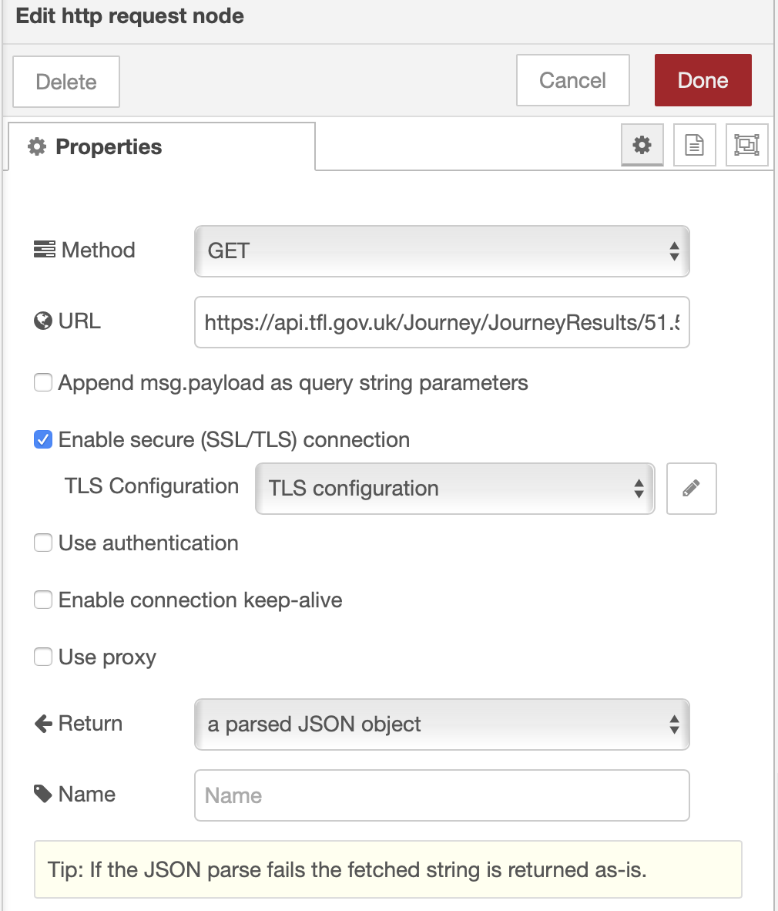

*Quick links :*
[Home](/README.md) - [Part 1](../part1/README.md) - [**Part 2**](../part2/README.md) - [Part 3](../part3/README.md) - [Part 4](../part4/README.md) - [Part 5](../part5/README.md)
***
**Part 2** - [Web and REST APIs](API.md) - [**Calling an API from Node-RED**](CALLING_API.md) - [Implementing an API in Node-RED](CREATING_API.md) - [API Practical](API_PRACTICAL.md)
***

# Calling an API from Node-RED

Node-RED makes it easy to call an API.  The HTTP Request node is used to make API calls.

For this section I will demonstrate the capabilities using the [Transport for London API](https://api.tfl.gov.uk/).  Like many APIs you need to register for a free API key to access the API.

I can use the API to plan a journey between 2 points.  For the example I will use Latitude and Longitude coordinates of 2 locations in London:

- 51.5026, -0.1128 - concourse of London Waterloo train station
- 51.5179, -0.0908 - Fore Street, Moorgate, London

The basic API to ask for a journey is ```https://api.tfl.gov.uk/Journey/JourneyResults/51.5026,-0.1128/to/51.5179,-0.0908```

The start and end points of the journey are part of the URL.  There is the option to make the request more specific by adding query parameters ```https://api.tfl.gov.uk/Journey/JourneyResults/51.5026,-0.1128/to/51.5179,-0.0908?nationalSearch=false&date=20190920&time=1200&timeIs=Arriving&journeyPreference=LeastWalking&mode=tube,walking```

This API needs to pass an app_id and app_key as query parameters on each API call ```app_id=0abcdef&app_key=12345678901234567890123456789012```, which needs to be appended to the URL.

The http request node is used to make the API call.  In the configuration of the http request node there are a number of options available 

- the Method allows you to specify the required http method for the call
- the URL allows the URL to be specified - there are some ways to modify the content of the URL which we will look at
- there are other options to allow SSL configuration, specify basic http authentication parameters, allow proxied connections
- the Return property specifies how the results are handled.  Above we expect JSON to be returned from the API call and want the results to be parsed into a JavaScript object.

Note:  *When sending a URL to a server the URL string needs to be URL encoded, to replace any characters not permitted in a URL with the '%' followed by their character code values.  The HTTP Request node takes care of any required URL encoding.  E.g the ```mode=tube,walking``` query parameter is sent as ```mode=tube%2cwalking```*

## Modifying the URL from a flow

You can manipulate the URL in a number of ways.  If you are making a GET request and don't need to send any data to the API call then the payload can be used to append query parameters to the specified URL.  The payload must contain a JavaScript object, .e.g.

- URL : ```https://api.tfl.gov.uk/Journey/JourneyResults/51.5026,-0.1128/to/51.5179,-0.0908```
- msg.payload : ```{
    "nationalSearch": "false",
    "date": "20190920",
    "time": "1200",
    "timeIs": "Arriving",
    "journeyPreference": "LeastWalking",
    "mode": "tube,walking",
    "app_id": "0abcdef",
    "app_key": "12345678901234567890123456789012"
}```
- Append msg.payload as query string parameters is enabled

produces the same API call as specifying the query parameters in the URL, but now the flow can manipulate the values passed as query parameters.

You can also use [mustache](http://mustache.github.io/mustache.5.html) style tags within a URL to allow the URL to be created from data sent to the node.  So using the previous example if I wanted to provide the start and end locations as part of the message arriving at the node, then I could do:

- URL : ```https://api.tfl.gov.uk/Journey/JourneyResults/{{{start}}}/to/{{{end}}}```
- msg.payload : ```{
    "nationalSearch": "false",
    "date": "20190920",
    "time": "1200",
    "timeIs": "Arriving",
    "journeyPreference": "LeastWalking",
    "mode": "tube,walking",
    "app_id": "0abcdef",
    "app_key": "12345678901234567890123456789012"
}```
- msg.start : ```"51.5026,-0.1128"```
- msg.end : ```"51.5179,-0.0908"```
- Append msg.payload as query string parameters is enabled

so now all the parameters to the API call are passed into the https request node as part of the incoming message, so the flow has control of the parameters.

I could have specified all the query parameters in the URL and used mustache tags to fill in the values, but using the combined approach gives me the flexibility to add and remove query parameters, such as not specifying the journeyPreference option.

For HTTP methods that need to pass data to the server, then the msg.payload is used to as the body of the HTTP request

## Specifying a return type

By default this API returns JSON data, but I can modify the data format returned by the API by setting an **Accept** header.  The API allows use of **text/xml** or **application/xml** in addition to the **application/json** value.

To set a header in the HTTP request you need to pass in the values in the msg.headings property.  This should be a JavaScript object.  

E.g. **msg.headers** = ```{ "Accept": "text/xml" }```

Note : If the **Return** property is set as parsed JSON then the API needs to return JSON data.

***
**Part 2** - [Web and REST APIs](API.md) - [**Calling an API from Node-RED**](CALLING_API.md) - [Implementing an API in Node-RED](CREATING_API.md) - [API Practical](API_PRACTICAL.md)
***
*Quick links :*
[Home](/README.md) - [Part 1](../part1/README.md) - [**Part 2**](../part2/README.md) - [Part 3](../part3/README.md) - [Part 4](../part4/README.md) - [Part 5](../part5/README.md)
