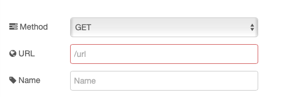

*Quick links :*
[Home](/README.md) - [Part 1](../part1/README.md) - [**Part 2**](../part2/README.md) - [Part 3](../part3/README.md) - [Part 4](../part4/README.md) - [Part 5](../part5/README.md)
***
**Part 2** - [Web and REST APIs](API.md) - [Calling an API from Node-RED](CALLING_API.md) - [**Implementing an API in Node-RED**](CREATING_API.md) - [API Practical](API_PRACTICAL.md)
***

# Creating an API

Node-RED provides 2 nodes to implement an HTTP API, the **HTTP in** and **HTTP response** nodes.

The **HTTP in** node is used to create the API endpoint and accept requests from clients.  The **HTTP response** node sends the response back to the client.


The configuration for the **HTTP in** node allows you to specify the HTTP method and URL for the endpoint .

In the previous section we saw the API for Transport for London.  The API endpoint used had parameters in the URL path ```https://api.tfl.gov.uk/Journey/JourneyResults/51.5026,-0.1128/to/51.5179,-0.0908```, where the start and end locations are provided in the URL.

If you wanted to implement this API the **Method** config would be **GET** and **URL** would be ```/Journey/JourneyResults/:start/to/:end```.  Specify a parameter using the colon (**:**) before the name.

Parameters are made available in the message leaving the **HTTP in** node.

- msg.payload - contains the body sent to the API by the client or if the request is a GET request any query parameters sent in the URL
- msg.req.body - contains the body of the incoming request
- msg.req.headers - contains the HTTP headers sent by the client
- msg.req.query - contains any query parameters
- msg.req.params - contains any parameters that are part of the URL path

So sending the request ```http://localhost:1880/Journey/JourneyResults/51.5026,-0.1128/to/51.5179,-0.0908?nationalSearch=false&date=20190920&time=1200&timeIs=Arriving&journeyPreference=LeastWalking&mode=tube,walking&app_id=0abcdef&app_key=12345678901234567890123456789012``` to our endpoint will generate the following (some additional content has been removed for clarity ):

```JSON
{
  "payload": {
    "nationalSearch":"false",
    "date":"20190920",
    "time":"1200",
    "timeIs":"Arriving",
    "journeyPreference":"LeastWalking",
    "mode":"tube,walking",
    "app_id":"0abcdef",
    "app_key":"12345678901234567890123456789012"
  },
  "req":{
    "headers":{
      "accept":"application/json"
    },
    "method":"GET",
    "params":{
      "start":"51.5026,-0.1128",
      "end":"51.5179,-0.0908"
    },
    "query":{
        "nationalSearch":"false",
        "date":"20190920",
        "time":"1200",
        "timeIs":"Arriving",
        "journeyPreference":"LeastWalking",
        "mode":"tube,walking",
        "app_id":"0abcdef",
        "app_key":"12345678901234567890123456789012"
    },
    "body":{}
  },
  "res":{...}
}
```

All parameters sent by the client are available in properties of the **msg.req** object.  The payload also provides a convenience way of accessing query parameters or the message body.

## Providing a response

Once a request has been received, the parameters are available in the message leaving the **HTTP in** node, but no response is sent back to the client.  To send a response back to the client the flow must end with a **HTTP response** node and the **res** property received in the **HTTP in** node must be passed through to the response node unaltered..

A response should contain a valid [status code](https://tools.ietf.org/html/rfc7231#section-6) and any data to be returned to the client should be available in the body of the response.  The **Content-Type** HTTP header should be set with the correct value specifying the [format](https://www.iana.org/assignments/media-types/media-types.xhtml) of the data sent back to the client in the HTTP message body.

The Status code and headers can be specified in the **HTTP response** node configuration, but it is more common to provide the values in the message sent to the **HTTP response** node.  The following properties should be set on the message sent to the **HTTP response** node:

- msg.payload - the data to be sent back to the client in the body of the message
- msg.statusCode - the HTTP status code to be sent to the client
- msg.headers - a JavaScript object containing the headers to send back to the client

***
**Part 2** - [Web and REST APIs](API.md) - [Calling an API from Node-RED](CALLING_API.md) - [**Implementing an API in Node-RED**](CREATING_API.md) - [API Practical](API_PRACTICAL.md)
***
*Quick links :*
[Home](/README.md) - [Part 1](../part1/README.md) - [**Part 2**](../part2/README.md) - [Part 3](../part3/README.md) - [Part 4](../part4/README.md) - [Part 5](../part5/README.md)
