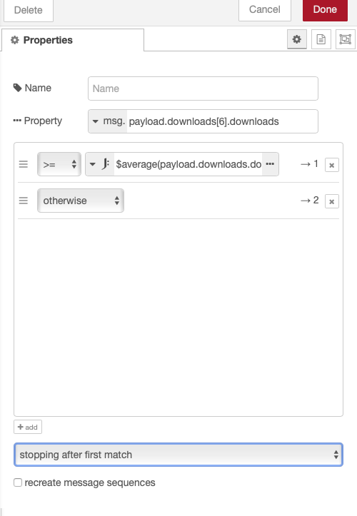

*Quick links :*
[Home](/README.md) - [Part 1](../part1/README.md) - [Part 2](../part2/README.md) - [**Part 3**](../part3/README.md) - [Part 4](../part4/README.md) - [Part 5](../part5/README.md)
***
**Part 3** - [Intro to JSONata](INTRO.md) - [Data transformation](JSONata_TRANSFORM.md) - [**JSONata in switch node**](JSONata_SWITCH.md) - [Practical work](JSONata_PRACTICAL.md)
***

# Using JSONata in a switch node

In this section we will use JSONata to calculate a value in a switch node.

We will get Node-RED download data from npm and use it to determine if the number of downloads yesterday was greater or less than the average number of downloads over the last 7 days.

You can get the download data for Node-RED using the URL : [https://api.npmjs.org/downloads/range/last-week/node-red](https://api.npmjs.org/downloads/range/last-week/node-red)

1. In the Node-RED editor drag an inject node, http request node and debug node onto the sheet
2. Open the http request node editor pane.  Ensure the Method is set to GET, enter the URL and set the return type to '**a parsed JSON onject**' 
3. Connect the inject node to the http request node and the debug node so you can test the https request is working 
4. Insert a switch node after the http request node then set the properties as shown then open the JSONata editor 
5. Copy the result of the test HTTP request from the debug panel and paste it as the payload value in the JSONata test panel, replacing the "hello world" string. 
6. Enter the JSONata expression to access the download values : ```payload.downloads.downloads```, which will return an array of values representing the number of downloads for the last 7 days.
7. To calculate the average use the JSONata function $average : ```$average(payload.downloads.downloads)``` which will produce a single value which is the average number of downloads for the last 7 days 
8. Now alter the switch statement to compare yesterdays downloads (last entry in returned array - ```msg.payload.downloads[6].downloads```) with the calculated average 
9. Handle the 2 outputs from the switch to output if the number of downloads was less or greater or equal to the past week average.

The sample solution flow for this exercise is here :

```JSON
[{"id":"60f97345.24d704","type":"inject","z":"78e6a193.5e7df8","name":"","topic":"","payload":"","payloadType":"date","repeat":"","crontab":"","once":false,"onceDelay":0.1,"x":180,"y":580,"wires":[["2feaf406.cf9f54"]]},{"id":"2feaf406.cf9f54","type":"http request","z":"78e6a193.5e7df8","name":"","method":"GET","ret":"obj","paytoqs":false,"url":"https://api.npmjs.org/downloads/range/last-week/node-red","tls":"","persist":false,"proxy":"","authType":"","x":330,"y":600,"wires":[["a2e91491.07144"]]},{"id":"fb6b184c.34cbb","type":"debug","z":"78e6a193.5e7df8","name":"","active":true,"tosidebar":true,"console":false,"tostatus":false,"complete":"false","x":790,"y":620,"wires":[]},{"id":"a2e91491.07144","type":"switch","z":"78e6a193.5e7df8","name":"","property":"payload.downloads[6].downloads","propertyType":"msg","rules":[{"t":"gte","v":"$average(payload.downloads.downloads)","vt":"jsonata"},{"t":"else"}],"checkall":"true","repair":false,"outputs":2,"x":470,"y":620,"wires":[["78ccde2a.8a133"],["b21d3e64.07f77"]]},{"id":"78ccde2a.8a133","type":"change","z":"78e6a193.5e7df8","name":"","rules":[{"t":"set","p":"payload","pt":"msg","to":"greater or equal","tot":"str"}],"action":"","property":"","from":"","to":"","reg":false,"x":620,"y":600,"wires":[["fb6b184c.34cbb"]]},{"id":"b21d3e64.07f77","type":"change","z":"78e6a193.5e7df8","name":"","rules":[{"t":"set","p":"payload","pt":"msg","to":"less","tot":"str"}],"action":"","property":"","from":"","to":"","reg":false,"x":620,"y":640,"wires":[["fb6b184c.34cbb"]]}]
```

***
**Part 3** - [Intro to JSONata](INTRO.md) - [Data transformation](JSONata_TRANSFORM.md) - [**JSONata in switch node**](JSONata_SWITCH.md) - [Practical work](JSONata_PRACTICAL.md)
***
*Quick links :*
[Home](/README.md) - [Part 1](../part1/README.md) - [Part 2](../part2/README.md) - [**Part 3**](../part3/README.md) - [Part 4](../part4/README.md) - [Part 5](../part5/README.md)
