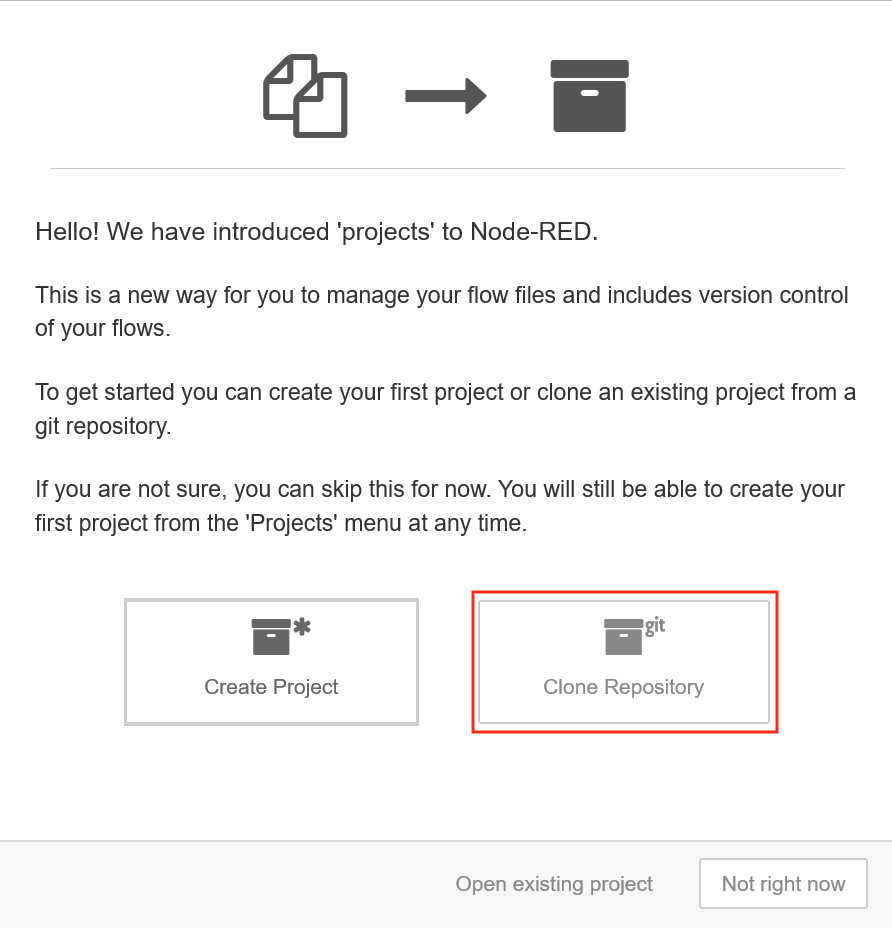
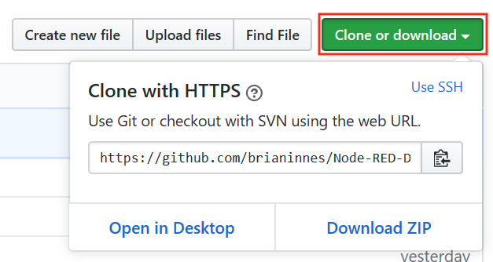

*Quick links :*
[Home](/README.md) - [Part 1](../part1/README.md) - [Part 2](../part2/README.md) - [Part 3](../part3/README.md) - [Part 4](../part4/README.md) - [**Part 5**](../part5/README.md)
***
**Part 5** - [**Codebase**](CODEBASE.md) - [Dependencies](DEPENDENCIES.md) - [Config](CONFIG.md) - [Backing services](BACKING.md) - [Build, release, run](BUILD.md) - [Processes](PROCESSES.md) - [Port binding](PORT.md) - [Concurrency](CONCURRENCY.md) - [Disposability](DISPOSABILITY.md) - [Dev/prod parity](PARITY.md) - [Logs](LOGS.md) - [Admin processes](ADMIN.md)
***

# I - [Codebase](https://12factor.net/codebase)

*One codebase tracked in revision control, many deploys*

First we need to decide what is a Node-RED application code base?

The Node-RED application is defined by a flow file and an optional credentials file.  However, the flow may require some additional nodes to be installed to the runtime and the flow also runs within a Node.js application, which is the Node-RED runtime.  This runtime can be customised and configured, so to fully capture a Node-RED application code base you need to capture the :

- application flow and credential file
- the package.json file, which captures all required Node.js and Node-RED node packages needed by the flow
- the Node-RED runtime

For this workshop a [starter git project](https://github.com/binnes/Node-RED-Docker) has been provided, containing a Node-RED runtime, customised to be managed by a cloud.

Node-RED has the [**projects**](https://nodered.org/docs/user-guide/projects/) feature, which is turned off by default.  It allows Node-RED to work with a revision control system to manage the Node-RED flow and associated content.  This can be considered the application source?

However, there are additional file needed if you want to be able to customise the runtime settings.

In this section you will fork a git repo, which is a starter template for a new project.

1. Open a browser an navigate to the [git starter project repo](https://github.com/binnes/Node-RED-Docker)
2. Make sure you are logged into your github account then press the **Fork** button so you have your own copy of the repo 
3. Open the git settings  
  
4. Select **Developer settings** then **Personal access tokens** then **Generate new token**.  Give the token a use, select all scopes except `admin:enterprise` and `admin:gpg.key` scope then **Generate token** 
5. On your system edit file .node-red/settings.js in your home directory.  At the bottom of the file change the projects setting to `enabled : true` 
6. Start Node-RED running locally on your system.  If it is already running stop it by entering **Ctrl-c** in the command window where it is running.  Use command `node-red` to start Node-RED
7. Open a browser to access your local Node-RED runtime on [http://localhost:1880](http://localhost:1880) and you should see a Projects wizard, as you've just enabled the project feature in the Node-RED editor. 
8. Select the Clone Repository.
    - Enter your git credentials (use the Personal Access Token as the password)
    - give the Node-RED project a name
    - copy the Git repo URL from your git repo github page: 
    - press the Clone project button when all the details have been completed - leave the Credentials encryption key field blank 
9. Drag an inject and debug node onto the sheet and connect them to create a basic flow then deploy the changes 
10. Switch to the project history section in the side panel, where you can see the flows.json file has uncommitted local changes.  Move your mouse over the entry and press the **+** button to stage the change 
11. The flows.json file is now ready to be committed.  Press the commit button then enter a commit message **basic flow** to commit the flow change  
  
12. Switch to the **Commit History** section of the project panel.  Here you can see the last commit and also that the local git branch is 1 commit ahead of the remote master.  Click the up arrow to open the Manage remote branch panel 
13. Press the **Push** button to send the commit to the remote branch 

You can also pull changes from the repo, so if a team is working on the same Node-RED application they can push changes and the other team members can pull the changes.

**Note**: There is an issue when running on Windows 10 - the git push is not passing the git credentials correctly.  If this is the case you can issue a `git push` command from a console window with the current directory the active git project directory : *user home dir*\\.node-red\\projects\\*repo name*

***
**Part 5** - [**Codebase**](CODEBASE.md) - [Dependencies](DEPENDENCIES.md) - [Config](CONFIG.md) - [Backing services](BACKING.md) - [Build, release, run](BUILD.md) - [Processes](PROCESSES.md) - [Port binding](PORT.md) - [Concurrency](CONCURRENCY.md) - [Disposability](DISPOSABILITY.md) - [Dev/prod parity](PARITY.md) - [Logs](LOGS.md) - [Admin processes](ADMIN.md)
***
*Quick links :*
[Home](/README.md) - [Part 1](../part1/README.md) - [Part 2](../part2/README.md) - [Part 3](../part3/README.md) - [Part 4](../part4/README.md) - [**Part 5**](../part5/README.md)
