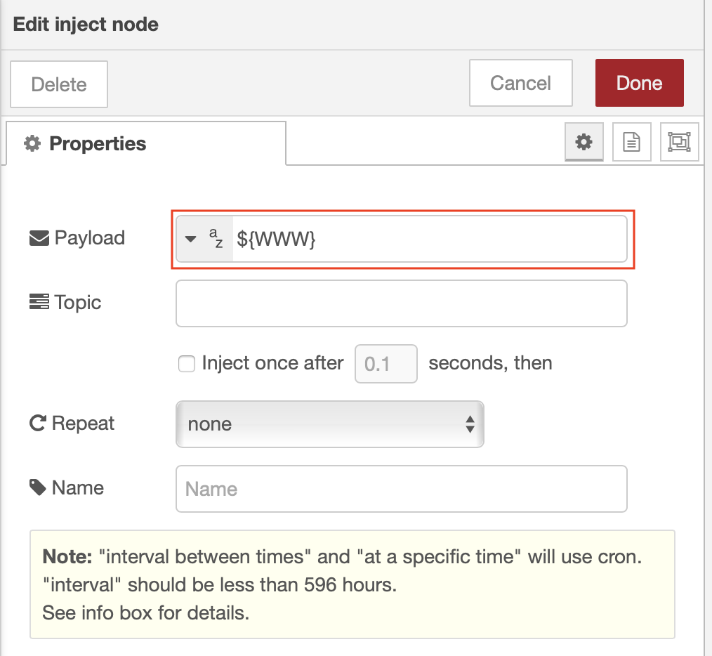
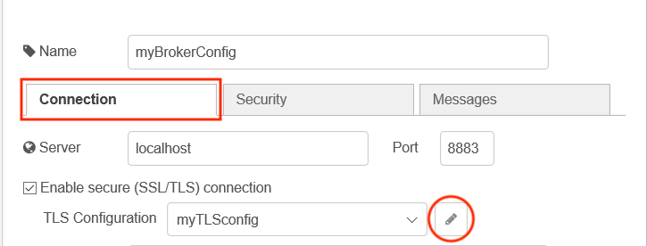
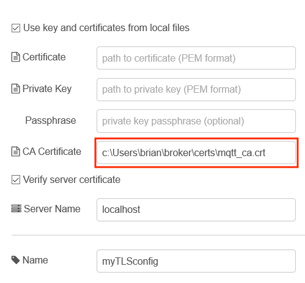
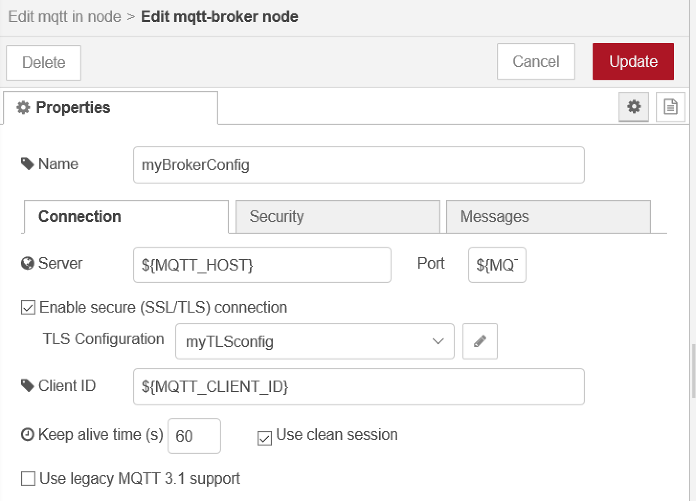
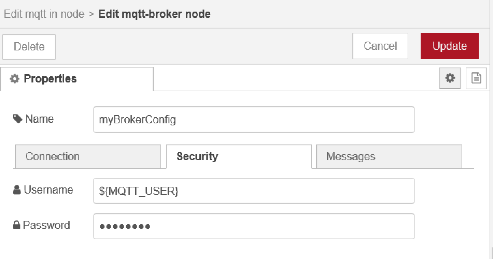

*Quick links :*
[Home](/README.md) - [Part 1](../part1/README.md) - [Part 2](../part2/README.md) - [Part 3](../part3/README.md) - [Part 4](../part4/README.md) - [**Part 5**](../part5/README.md)
***
**Part 5** - [Codebase](CODEBASE.md) - [Dependencies](DEPENDENCIES.md) - [**Config**](CONFIG.md) - [Backing services](BACKING.md) - [Build, release, run](BUILD.md) - [Processes](PROCESSES.md) - [Port binding](PORT.md) - [Concurrency](CONCURRENCY.md) - [Disposability](DISPOSABILITY.md) - [Dev/prod parity](PARITY.md) - [Logs](LOGS.md) - [Admin processes](ADMIN.md)
***

# III - [Config](https://12factor.net/config)

*Store config in the environment*

As an application is deployed in different environments (production, test) or in different regions of a production systems, then it often needs to connect to different services, so needs different configuration.  If the configuration is embedded in the application then a different build is needed for each deployment, which breaks the idea of a single build being deployed multiple times.

Cloud runtime environment pass configuration to applications through a number of different mechanisms.  Setting environment variables is a common approach.

In Node-RED the configuration is usually found within the configuration of the nodes.  In the previous section, when you enabled projects within the Node-RED editor you disabled configuration encryption, so it is easy to see the configuration

Some nodes are aware of Cloud Foundry services and will pull configuration from the **VCAP_SERVICES** environment variable to be able to automatically connect with Cloud Foundry hosted services.

## Enabling a Node-RED flow to get configuration from Environment Variables

In Node-RED you can get a property to be replaced by an environment variable by using syntax **${ENV_VAR}** in any string based configuration property.

So if I have an inject node and I set the payload property to be a string value **${WWW}** then the value I would inject will be the value of environment variable WWW (if the environment variable WWW is set):
.

To set an environment variable in a command window:

- Linux and MacOS : `export WWW=123`
- Windows : `set WWW=q123`

To see all environment variable that are set, simple enter command `set` on Linux, MacOS and Windows and you will see all the environment variables that are set.

## MQTT node config

In this section you will connect to the MQTT broker running in docker on your workstation.  If it is not running start it now and ensure you have the user password created, then follow the steps:

1. Import the following flow :

    ```JSON
    [{"id":"7b7f69b7.705f88","type":"mqtt in","z":"5b0d2ab.1870cd4","name":"","topic":"#","qos":"2","datatype":"json","broker":"1a95b079.ea9fb","x":150,"y":360,"wires":[["c588d285.452a9"]]},{"id":"c588d285.452a9","type":"debug","z":"5b0d2ab.1870cd4","name":"","active":true,"tosidebar":true,"console":true,"tostatus":false,"complete":"true","targetType":"full","x":470,"y":360,"wires":[]},{"id":"b0001fb7.0603f","type":"inject","z":"5b0d2ab.1870cd4","name":"","topic":"","payload":"","payloadType":"str","repeat":"10","crontab":"","once":false,"onceDelay":0.1,"x":170,"y":240,"wires":[["3bbf6804.8fe838"]]},{"id":"3bbf6804.8fe838","type":"change","z":"5b0d2ab.1870cd4","name":"","rules":[{"t":"set","p":"payload","pt":"msg","to":"{ \"time\" : $fromMillis($toMillis($now()),'[H]:[m]:[s]') }","tot":"jsonata"}],"action":"","property":"","from":"","to":"","reg":false,"x":320,"y":260,"wires":[["5fcb1a88.708a64"]]},{"id":"5fcb1a88.708a64","type":"mqtt out","z":"5b0d2ab.1870cd4","name":"","topic":"time","qos":"","retain":"","broker":"1a95b079.ea9fb","x":470,"y":280,"wires":[]},{"id":"1a95b079.ea9fb","type":"mqtt-broker","z":"","name":"myBrokerConfig","broker":"localhost","port":"8883","tls":"64dd09ff.068248","clientid":"nodered","usetls":true,"compatmode":false,"keepalive":"60","cleansession":true,"birthTopic":"","birthQos":"0","birthRetain":"false","birthPayload":"","closeTopic":"","closeQos":"0","closeRetain":"false","closePayload":"","willTopic":"","willQos":"0","willRetain":"false","willPayload":""},{"id":"64dd09ff.068248","type":"tls-config","z":"","name":"myTLSconfig","cert":"","key":"","ca":"c:\\Users\\brian\\broker\\certs\\mqtt_ca.crt","certname":"","keyname":"","caname":"","servername":"localhost","verifyservercert":true}]
    ```

2. Open up the configuration of either of the mqtt nodes and select the edit icon next to the MQTT server config 
3. Switch to the **Security** tab and enter the MQTT broker credentials.  These are the credentials you created using the mosquitto_passwd command when running the [broker in Docker](broker/README.md) - mosquitto / passw0rd 
4. Switch to the **Connection** tab and open the TLS Configuration 
5. Enter the full path to where your root certificate is located on your system, replacing what is already configured 
6. Press the update and Done buttons to save the configuration, then Deploy the flow. You should see the MQTT nodes connected to your mqtt broker 

To prevent config being captured in a flow you can replace all configuration of nodes by environment variables, so at run time the environment can provide the configuration to a flow, rather than the configuration being trapped in the flow.  This works for all string based values (including passwords).

1. Open up the server config and make the following changes on the Connection tab:
    - set the Server to ${MQTT_HOST}
    - set the Port to ${MQTT_PORT}
    - set the Client ID to ${MQTT_CLIENT_ID}
2. Switch to the Security tab:
    - set the Username to ${MQTT_USER}
    - set the Password tp ${MQTT_PWD} (you won't be able to see this, as the password field hides the content)
3. Switch back to the Connection tab and open the TLC config editor
    - set the CA Certificate to ${MQTT_CA_CERT}
    - set the Server name to ${MQTT_HOST}
4. Press Update and Done to close the config panels then Deploy the flow.
5. Stop Node-RED by entering Ctrl-c in the command window where Node-RED was started

For an MQTT node this is what the config may look like:
  and the resultant flow file segment :

```JSON
  {
      "id": "7a44476d.a179c8",
      "type": "mqtt-broker",
      "z": "",
      "name": "myBrokerConfig",
      "broker": "${MQTT_HOST}",
      "port": "${MQTT_PORT}",
      "tls": "850bd469.ceb218",
      "clientid": "${MQTT_CLIENT_ID}",
      "usetls": true,
      "compatmode": false,
      "keepalive": "60",
      "cleansession": true,
      "birthTopic": "",
      "birthQos": "0",
      "birthRetain": "false",
      "birthPayload": "",
      "closeTopic": "",
      "closeQos": "0",
      "closeRetain": "false",
      "closePayload": "",
      "willTopic": "",
      "willQos": "0",
      "willRetain": "false",
      "willPayload": ""
  },
  {
      "id": "850bd469.ceb218",
      "type": "tls-config",
      "z": "",
      "name": "myTLSconfig",
      "cert": "",
      "key": "",
      "ca": "${MQTT_CA_CERT}",
      "certname": "",
      "keyname": "",
      "caname": "",
      "servername": "${MQTT_HOST}",
      "verifyservercert": true
  },
```

and flow credentials file:

```JSON
{
    "7a44476d.a179c8": {
        "user": "${MQTT_USER}",
        "password": "${MQTT_PWD}"
    },
    "850bd469.ceb218": {}
}
```

You can see the environment variables, which will be substituted at runtime for the values contained in the environment variables.

To run locally the environment variables need to be set before Node-RED is started, so they are available when Node-RED loads and runs the flow.

For docker you can use the **-e** option to pass in environment variables.  For a docker application containing the above configuration, the command to run the container might look like:

 `docker run -dit -e MQTT_CLIENT_ID=nodeRED -e MQTT_HOST=mqttBroker -e MQTT_PORT=8883 -e MQTT_PWD="passw0rd" -e MQTT_USER="mosquitto" -e MQTT_CA_CERT=/mosquitto/certs/mqtt_ca.crt --add-host mqttBroker:[IP address of host] -v [localhost of broker directory within part 5 directory of this repo]:/mosquitto -p 1880:1880 --name dockerNR [your docker hub username]/node-red-docker-sample:latest`

Notice:

- you need to provide the values for content in square brackets in the above command : **[ ]**
- all the environment variables are set with the **-e** option
- the directory containing the certificates is mapped to a local directory **/mosquitto** within the container using the **-v** option.  The **MQTT_CA_CERT** environment variable references the root certificate authority certificate from within this directory.
- The **mqttBroker** network address is added to the hosts file within the container using the **--add-host** option.  The **MQTT_HOST** environment variable is set to **mqttBroker**, so requires the container can find the network address using hostname **mqttBroker**.  You need to know the IP address of your host system when using this option.  There are many ways to get the IP address of the host system, from using GUI tools on the desktop to command line options.  Here are options that work on the command line:
  - on Linux and MacOS you can use **ifconfig** to get the IP address
  - on Windows 10 you can use **ipconfig** to get the IP address

***
**Part 5** - [Codebase](CODEBASE.md) - [Dependencies](DEPENDENCIES.md) - [**Config**](CONFIG.md) - [Backing services](BACKING.md) - [Build, release, run](BUILD.md) - [Processes](PROCESSES.md) - [Port binding](PORT.md) - [Concurrency](CONCURRENCY.md) - [Disposability](DISPOSABILITY.md) - [Dev/prod parity](PARITY.md) - [Logs](LOGS.md) - [Admin processes](ADMIN.md)
***
*Quick links :*
[Home](/README.md) - [Part 1](../part1/README.md) - [Part 2](../part2/README.md) - [Part 3](../part3/README.md) - [Part 4](../part4/README.md) - [**Part 5**](../part5/README.md)
