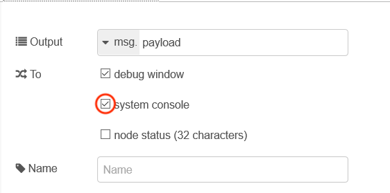

*Quick links :*
[Home](/README.md) - [Part 1](../part1/README.md) - [Part 2](../part2/README.md) - [Part 3](../part3/README.md) - [Part 4](../part4/README.md) - [**Part 5**](../part5/README.md)
***
**Part 5** - [Codebase](CODEBASE.md) - [Dependencies](DEPENDENCIES.md) - [Config](CONFIG.md) - [Backing services](BACKING.md) - [Build, release, run](BUILD.md) - [Processes](PROCESSES.md) - [Port binding](PORT.md) - [Concurrency](CONCURRENCY.md) - [Disposability](DISPOSABILITY.md) - [Dev/prod parity](PARITY.md) - [**Logs**](LOGS.md) - [Admin processes](ADMIN.md)
***

# XI - [Logs](https://12factor.net/logs)

*Treat logs as event streams*

Node-RED outputs logs to stdout, so can any cloud environment or log service can capture the output.  

If you use the **Debug** node to log messages, you need to configure the Debug node to log to the system console if you want to see the output 

When using Docker to run an application container the **logs** action can be used to display logs.  The **-f** option can be used to get a live stream of the log :

`docker logs -f dockerNR`

Logging options can be modified in the settings.js file to get the required logging level and output format.

***
**Part 5** - [Codebase](CODEBASE.md) - [Dependencies](DEPENDENCIES.md) - [Config](CONFIG.md) - [Backing services](BACKING.md) - [Build, release, run](BUILD.md) - [Processes](PROCESSES.md) - [Port binding](PORT.md) - [Concurrency](CONCURRENCY.md) - [Disposability](DISPOSABILITY.md) - [Dev/prod parity](PARITY.md) - [**Logs**](LOGS.md) - [Admin processes](ADMIN.md)
***
*Quick links :*
[Home](/README.md) - [Part 1](../part1/README.md) - [Part 2](../part2/README.md) - [Part 3](../part3/README.md) - [Part 4](../part4/README.md) - [**Part 5**](../part5/README.md)
